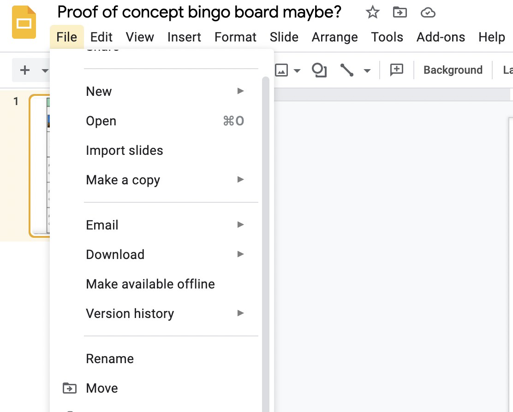

## How to play

Here’s how it works: Below, you can see a BINGO-Board with a number of clues on it - the solutions are all locations within Berlin city limits. Your job (as **a single person or a group of up to four people**) is to **solve the clue, visit the location and take a picture** – either of you(r group) or of your mascot – with it. You can then **upload the picture** to the corresponding square on the board – and maybe win a prize.
You can upload pictures until **October 31st at noon** - after that, the jury will deliberate and the winners will be announced on the page at **6pm**. 
**There will be three different categories**, one with three winners and the other with one winner. The categories are as follows:
**First, second and third (group) to get a BINGO** (horizontal / vertical / diagonal line with all letters included) 
**First (group) to complete the full board**
**Creative Prize**: This one is pretty open to interpretation. You may win with a single picture, or with what you did with your whole board.
 

## How to get, edit and submit your bingo board 

Click on [this link](https://docs.google.com/presentation/d/15JNROkP5hEKqj8FT10v7BiQ7l6xoQaJhc0Q55r6_bCM/edit?usp=sharing) to open the google doc
with the bingo board template.

Now make a copy of the board so you can edit it and add your own pictures. To make a copy go to files > make a copy.

 

If you dont have a google account you can also download the bingo board as a powerpoint presentation. The Humboldt University has a reduced office key which
can be found [here](https://www.cms.hu-berlin.de/de/dl/multimedia/bereiche/dmp/dmpblog/6efb498b4595e1a05efdf6d9317f3ea2) alternatively LibreOffice and OpenOffice 
are free alternatives. You are free to edit the template any other way you want to insert the pictures.

The rest of this instruction set assumes that you are editing in google slides, 

Once you have your own copy you can start replacing the prompts you fullfilled with the pictures you took. To do that right click on the picture and
select `replace image`.

Finally you still have to resize the image so it is fully visible (maybe we can skip that step by having the text pictures be exactly the size of our squares?)
In order to do that right click on the image, select resize image (if we do this repeat the picture from above with a different arrow) and use the appearing black
bars to resize which portion of your image is shown.

When you are satisfied and have achieved a bingo you can download your bingo board and submit it to us. To download the file you can go to files > download and
(we should pick what format the file should be). Then go to the submit tab and submit your bingo board. +

Congratulation! You have done it!
